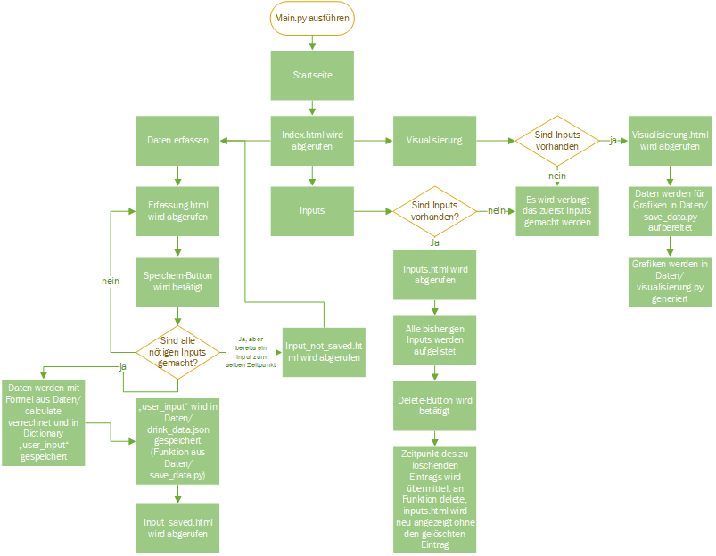

<h1>Webapplikation BAK Rechner</h1>

<h2>Ausgangslage</h2>

Wer gerne ab und zu mal etwas trinkt, hat sich sicher auch schon dieselbe Frage gestellt wie ich: 
Wie viel sind 0.5 Promille? 
Jeder Autofahrer weiss, dass er nur bei einer Blutalkoholkonzentration unter diesem Wert ein Fahrzeug steuern darf, 
doch woher soll man wissen, wie viel das genau ist? Diese Frage soll mit Hilfe des BAK Rechners zumindest ansatzweise beantwortet werden können. 
 Mit Hilfe des BAK Rechners kannst du mit ein paar wenigen Eingaben zu deinem Getränkekonsum herausfinden,
wann du allerspätestens wieder fahrtüchtig bist oder einfach ob du und dein Trinkpartner auf einem ähnlichen Level sind.
Der BAK Rechner gibt dir an, was deine minimale und maximale Blutalkoholkonzentration sind und errechnet eine ungefähre Schätzung der BAK. 
Das ganze wird dir visuell in einem Diagramm präsentiert, was das einfache Ablesen möglich macht.
Die Berechnungen werden nach der Widmark-Formel gemacht und sollten somit einigermassen akkurat sein.
 Link zum Wikipedia-Artikel --> https://de.wikipedia.org/wiki/Blutalkoholkonzentration

<h2>Betrieb</h2>
Um den BAK Rechner starten zu können, müssen zunächst folgende Bibliotheken installiert werden:
<ul>
<li>Flask (getestet auf Version 2.1.1)</li>
<li>plotly (getestet auf Version 5.8.2)</li>
<li>pandas (getestet auf Version 1.4.2)</li>
</ul>
Nachdem diese Pakete installiert wurden, führ einfach die "main.py" Datei aus, um den BAK Rechner zu starten.
Nun kannst du über einen beliebigen Browser http://127.0.0.1:5000/ oder http://localhost:5000/ besuchen, um auf die Startseite zu gelangen.

<h2>Benutzung</h2>
Der BAK Rechner sollte relativ selbsterklärend sein. Über die Navigation gelangst du auf die verschiedenen Unterseiten.
Um eine sinnvolle Funktion zu erhalten, müssen unter dem Tab "Daten erfassen" zunächst, you guessed it, Daten erfasst werden.
Einfach deine Daten ins Formular eingeben und zu unterst auf den "Speichern" Button drücken. Sobald du einen Eintrag speicherst, sollten dir alle deine Eingaben
angezeigt werden und du kannst sie kurz kontrollieren. Solltest du einen Fehler finden, kannst du deinen Eintrag unter dem Tab "Inputs" wieder löschen.
Dort siehst du auch alle deine bisher gemachten Einträge, wenn du also einfach nur sehen willst, was du alles eingetragen hast --> "Inputs".
Sobald du mindestens einen Eintrag gemacht hast, kannst du dir die dazugehörigen Berechnungen unter "Visualisierung" ansehen. 
Du findest dort drei Grafiken:
<ul>
<li>Dein BAK Verlauf</li>
<li>Eine Aufteilung nach mL, also wovon du am meisten getrunken hast</li>
<li>Eine Aufteilung nach BAK, also was den grössten Einfluss auf dich hatte</li>
</ul>
Achtung: Du kannst nicht mehrere Inputs mit dem selben Zeitpunkt abspeichern. Probierst du das, wirst du eine Fehlermeldung erhalten und dein Eintrag wird nicht gespeichert. 
Deine Inputs werden auf deinem Gerät gespeichert, wenn du also an einem anderen Tag erneut den BAK Rechner aufrufst, sollten deine Eingaben noch immer da sein.
Möchtest du einen neuen Tag erfassen, musst du zuerst alle deine bisherigen Inputs löschen.

<h2>Code-Architektur</h2>

<h2>(Noch) fehlende Funktionen</h2>
Der BAK Rechner könnte auch noch ein bisschen ausgebaut werden. Hier sind einige Funktionen, die praktisch wären, bisher aber noch nicht integriert wurden.
<ul>
<li>Aufteilung auf mehrere Personen: Die Visualisierungen sollen für unterschiedliche Personen angezeigt werden können. 
Die Filterung würde über den eingegebenen Namen funktionieren.</li>
<li>Anpassung der Inputs direkt im Inputs Tab: Bis jetzt müssen falsche Inputs gelöscht und neu erfasst werden. Ein Bearbeiten Button soll den User die Inputs direkt editieren lassen.</li>
<li>Userprofile: Ein User soll seine Inputs in seinem Profil speichern können und auch auf anderen Geräten abrufen.</li>
<li>Vergleich von mehreren Einträgen: Eine Gruppe von Einträgen kann gespeichert werden und mit einer anderen Gruppe verglichen werden. So soll man auch das Trinkverhalten über verschiedene Tage analysieren können.</li>
<li>Alles Löschen Button: Unter Inputs ein Button um gleich alle Einträge zu löschen, statt alle einzeln Löschen zu müssen.</li>
</ul>
